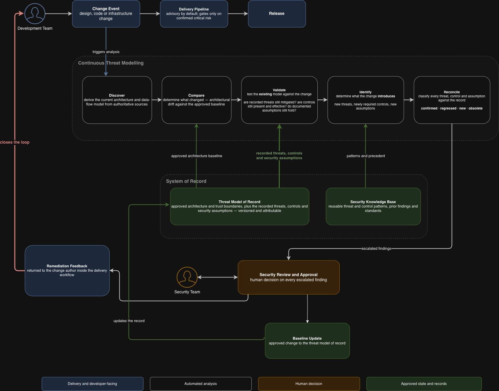
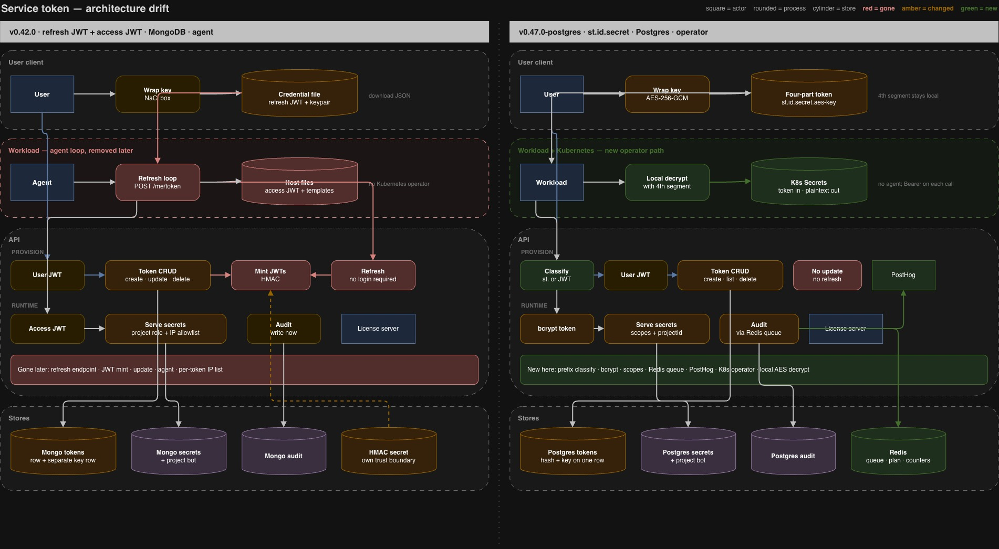

# Threat model drift — case study

Threat models are point-in-time. Draw a DFD, run a workshop, enumerate threats, and the model starts rotting on the next PR. That is truer with rapid AI-powered development and shrinking SSDLCs, which is why many organisations have quietly given up on “shift left.”

This case study is one run of a **lifecycle layer** that keeps a threat model alive from change events instead of regenerating it from scratch. A security engineer plus a seed agent produces the initial DFD, threats, assumptions, and mitigations. On a later change, the same record is tested: the DFD is updated from code, assumptions are revalidated, and only then are new threats identified. Each update is classified so a human can triage. Low-confidence or high-risk items are meant for the security team; the rest can flow through.

The point is the **harness**, not a clever one-shot agent. Company context here is the threat model of record plus the feature’s assumption set. Past dispositions are the stable `T#` / `M#` / `A#` IDs: confirmed items stay, obsolete classes drop out of the current set, dismissed surfaces are not re-invented as a green-field STRIDE pass. Flags (confirmed, regressed, new, obsolete) are how the organisation sees posture change against its own record.

The operational vision is a watcher on PRs. This repository demonstrates the same lifecycle on a real Infisical change event: two public tags of **service tokens**. The prompts are tag-agnostic and reusable. The pins exist so a reader can reproduce the artifacts from code.


| Pin          | Tag                                         | Role in the lifecycle  |
| ------------ | ------------------------------------------- | ---------------------- |
| Seed         | `infisical/v0.42.0` (`735cf093f0`)          | Threat model of record |
| Change event | `infisical/v0.47.0-postgres` (`041535bb47`) | Drift under test       |


Between those pins the credential is not the same object. The seed is a JWT access/refresh pair, authorized by a project role, stored in MongoDB, with an agent refresh loop. The later pin is a durable `st.{id}.{secret}`, authorized by stored scopes, stored in Postgres, with a Kubernetes operator path. Regenerating a threat model at the later pin would hide that. The lifecycle has to ask what happened to the record.

## Lifecycle



Editable source: [threat-model-drift-v4.drawio](threat-model-drift-v4.drawio).

A change event triggers analysis. **Discover** derives the current architecture. **Compare** measures it against the approved baseline. **Validate** tests the existing model (are recorded threats still mitigated, controls still present, assumptions still true). **Identify** names what the change introduces. **Reconcile** classifies every threat, control, and assumption as **confirmed · regressed · new · obsolete**. Escalated findings go to security review. Remediation returns to the author. An approved change updates the threat model of record. Blue is delivery; white is automated analysis; amber is human decision; green is approved state.

1. **Seed.** Engineer + agent. DFD from code. Assumptions tied to the feature. Threats and mitigations bound to both. A mitigation is only admissible if it names a threat it reduces and an assumption it upholds.
2. **Change event.** Here, a tag-to-tag evolution. In production, a PR that moves design, code, or infrastructure.
3. **Discover / Compare.** Current architecture from the later DFD; architectural delta against the seed DFD. Independently generated DFDs do not share IDs; mapping is by function.
4. **Validate.** Test the *existing* model. Are recorded threats still mitigated? Are controls still in code? Do documented assumptions still hold?
5. **Identify.** What the change *introduces*: new threats, controls, assumptions. STRIDE is a coverage checklist, not a reason to rebuild the list.
6. **Reconcile.** Every ID labeled **confirmed · regressed · new · obsolete**. Escalated findings go to a human. The report does not silently replace the threat model of record.
7. **Mature the assumptions.** Confirmed IDs are kept. Failed statements are restated to what is true now. Obsolete JWT-lifetime claims drop from the current set. The revised file is the seed for the next event.


## Architecture drift (this change event)



Editable source: [serviceTokenDfd-consolidated-v0.42.0-v0.47.0-postgres.drawio](serviceTokenDfd-consolidated-v0.42.0-v0.47.0-postgres.drawio).

Left is the seed (refresh JWT + access JWT, MongoDB, agent). Right is the change event (`st.{id}.{secret}`, Postgres, operator). Red is gone, amber is changed, green is new. The wrap, credential at rest, auth path, secret authorization, stores, and observability all moved. That is the Compare input the lifecycle tested; it is not itself a threat list.

## How to read this run

1. Lifecycle diagram above, then the side-by-side DFD.
2. Seed: [serviceTokenDfd-v0.42.0.md](serviceTokenDfd-v0.42.0.md), [securityAssumptions-0.42.0.md](securityAssumptions-0.42.0.md), [serviceTokenThreatModel-v0.42.0.md](serviceTokenThreatModel-v0.42.0.md).
3. Change-event DFD: [serviceTokenDfd-v0.47.0-postgres.md](serviceTokenDfd-v0.47.0-postgres.md).
4. Lifecycle output: [serviceTokenThreatModelDrift-v0.42.0-to-v0.47.0-postgres.md](serviceTokenThreatModelDrift-v0.42.0-to-v0.47.0-postgres.md) and [securityAssumptions-v0.47.0-postgres.md](securityAssumptions-v0.47.0-postgres.md).


## Prompts (the harness)

Placeholders only. No tag or feature is baked in. Run them on another feature or another change event.


| Prompt                                                           | Layer                           | Produces                                                                             |
| ---------------------------------------------------------------- | ------------------------------- | ------------------------------------------------------------------------------------ |
| [dfdAgentPrompt.md](dfdAgentPrompt.md)                           | Seed (and DFD update on change) | One descriptive Markdown DFD at a pin. No threats.                                   |
| [threatModelAgentPrompt.md](threatModelAgentPrompt.md)           | Seed                            | Threats and mitigations bound to that DFD and the assumption set.                    |
| [threatModelDriftAgentPrompt.md](threatModelDriftAgentPrompt.md) | Lifecycle                       | Drift report + revised assumptions. Validate first, identify second, reconcile last. |


Every claim about current behavior needs a `path:line` at the change-event pin. Absence of a formerly recorded control is a regression, not a missing bullet in a new model.

## What this change event did to the record

Closed: cross-project secret access (T1), inventory without a permission check (T10), and threats whose surfaces are gone (refresh grant, agent sink, built-in roles on the token).

Regressed: per-token IP allowlisting is gone, so possession of the three-part token is access from any address (T6). Seed assumptions about origin, JWT auth, generational revoke, and HMAC cost no longer hold as written.

New residual, for triage: durable presented credential (T17), bcrypt on every `st.` request (T15), SERVICE actors skipping per-import CASL (T16), four-part token as a workspace-key package including in cluster Secrets (T14, T18).

The drift report’s **Escalated findings** section is the security-team queue for this event. This case study does not auto-merge the record.

## Reproduce

```bash
git checkout infisical/v0.42.0            # seed DFD + baseline TM
git checkout infisical/v0.47.0-postgres   # change-event DFD + drift
```

JPGs render in this README. Open the matching `.drawio` files in [diagrams.net](https://app.diagrams.net/) or a draw.io editor extension to edit. Checkout only to read code at a pin.

This run is not a PR bot, a confidence scorer, or an org-wide disposition store. Those belong to a deployment of the same lifecycle. What is in this repo is the seed, one change event, the harness prompts, and a matured assumption set ready for the next event.

## Reading the drift report

[serviceTokenThreatModelDrift-v0.42.0-to-v0.47.0-postgres.md](serviceTokenThreatModelDrift-v0.42.0-to-v0.47.0-postgres.md) is the output of one lifecycle run. Its ten sections are ordered so the record is tested before it is extended, and the later sections are only meaningful because the earlier ones constrained them. Read in order.

| §  | Section           | What it answers                                                                                              |
| -- | ----------------- | ------------------------------------------------------------------------------------------------------------ |
| 1  | Scope             | Which pins, which inputs, what was excluded. Closes by stating the report does not replace the record.       |
| 2  | Discover          | Architecture at the change-event pin, plus tables mapping baseline element IDs to current ones.               |
| 3  | Compare           | Architectural delta as **unchanged / changed / added / removed** per element class, then material differences. |
| 4  | Validate          | The existing record, one recorded `T#` / `M#` / `A#` at a time. Nothing here is new.                          |
| 5  | Identify          | Only what the change introduced: `T14`–`T19`, `M11`–`M15`, `A11`–`A15`.                                       |
| 6  | Reconcile         | Every ID labeled **confirmed · regressed · new · obsolete**, with a reason and current strength.              |
| 7  | Traceability      | Surviving `T#` → `M#` → `A#` triples. A threat with no row has no mitigation.                                 |
| 8  | Residual risk     | What is still open and what would close it.                                                                   |
| 9  | Escalated findings | The security-team queue for this event.                                                                      |
| 10 | Input defects     | Faults in the inputs themselves, not in the code.                                                             |

Section 4 is what makes this a lifecycle rather than a re-run. Each threat entry carries *Target then / now*, *Narrative still valid*, *Recorded mitigations*, *Strength then / now*, and `path:line` evidence; mitigations and assumptions end in a *Verdict*. A "no" on *Narrative still valid* is not a pass. `T1` is closed by a new check and `T2` is closed because its surface is gone — only §6 separates those as `confirmed` and `obsolete`. Likewise `A10` "fails" because bcrypt replaced an HMAC verify, which is a mechanism change, not a defect.

### Three vocabularies, read together

**Labels** (§6) are dispositions against the record: `confirmed` survived the test, `regressed` was true and is no longer covered, `new` arrived with the change, `obsolete` lost its surface. **Strength** grades a mitigation against a threat: `full`, `partial`, `conditional` (holds only under a configuration or operator choice), or `—`. **Assumption class** says how a statement behaves: *upheld by code*, *threat-enabling*, or *environmental*.

None of them reads alone. `T17` is `new` with `M14 partial; M8 conditional`, so possession of a durable token is bounded only by a bcrypt check and a nullable `expiresAt` — which is why §8 gives "set `expiresIn`" as what closes it. A `confirmed` threat is not a safe one: `T6` and `T7` are both still live with no mitigation at all.

### Resolving an ID across the repo

- **A recorded `T#` or `M#` in §4** — the original narrative is in [serviceTokenThreatModel-v0.42.0.md](serviceTokenThreatModel-v0.42.0.md) under the same ID and title. §4 gives the verdict, not the original text.
- **An element ID (`E#`, `P#`, `D#`, `F#`, `B#`)** — resolve it in the DFD *for that pin*: [serviceTokenDfd-v0.42.0.md](serviceTokenDfd-v0.42.0.md) or [serviceTokenDfd-v0.47.0-postgres.md](serviceTokenDfd-v0.47.0-postgres.md). **These do not correspond across pins.** The DFDs were generated independently, so baseline `P3` and current `P3` are unrelated; §2's tables are the mapping, and it is by function. This is the easiest way to misread the report.
- **An assumption** — the baseline file [securityAssumptions-0.42.0.md](securityAssumptions-0.42.0.md) has unnumbered bullets; the report numbers them `A1`–`A10` in file order, matching by name. Restated and new statements are in [securityAssumptions-v0.47.0-postgres.md](securityAssumptions-v0.47.0-postgres.md), which carries explicit IDs and has no `A2` or `A3` — obsolete assumptions drop out of the current set rather than being deleted from history.
- **Why a section exists at all** — [threatModelDriftAgentPrompt.md](threatModelDriftAgentPrompt.md) is the contract that produced the shape.

### What carries forward

`T#` / `M#` / `A#` are the stable identifiers across events; element IDs are local to one DFD. After this run, [securityAssumptions-v0.47.0-postgres.md](securityAssumptions-v0.47.0-postgres.md) plus the §6 tables are the seed for the next change event. §9 is the only section that asks a human for a decision.