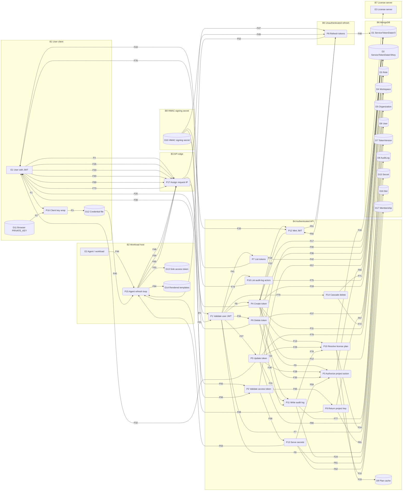

# Data flow diagram — service token

## 1. Scope

Feature: service token (`ServiceTokenDataV3` / `AuthMode.SERVICE_ACCESS_TOKEN`).

Version pin: `infisical/v0.42.0` (commit `735cf093f0`).

In scope: create, list, update, delete, refresh, project-key delivery, access-token authentication, project-role and IP authorization used with that access token, secret read/write routes that accept `SERVICE_ACCESS_TOKEN`, audit records for token CRUD, cascade delete with workspace or organization, audit-log actor listing, and the Infisical agent refresh loop.

Out of scope: service token v1 (`ServiceToken`) and v2 (`ServiceTokenData`). Kubernetes operator (calls `/api/v2/service-token` only). User login and org membership except as stores read during JWT validation and CASL. The project-members tab mounts `ServiceTokenSection` and does not mount `ServiceTokenV3Section` (`frontend/src/views/Project/MembersPage/components/ServiceTokenTab/ServiceTokenTab.tsx:17-18`). Frontend v3 hooks remain in source and share the JWT HTTP contracts below.

## 2. Diagram

## 3. External entities

| ID | Name | Originates or receives |
|---|---|---|
| E1 | User with JWT | Originates create, update, delete, list, cascade-delete, and audit-actor-filter requests. Receives `serviceTokenData`, a refresh JWT on create, and actor-filter rows. |
| E2 | Agent / workload | Originates the agent config, refresh requests, secret reads, and project-key reads. Receives access JWT, optional rotated refresh JWT, key ciphertext, and plaintext secret pairs. |
| E3 | License server | Receives `GET /api/license-server/v1/customers/:customerId/cloud-plan` when `instanceType === "cloud"`. Returns a `FeatureSet` including `ipAllowlisting` and `auditLogsRetentionDays`. |

## 4. Processes

| ID | Name | Path | Decides or transforms | Privilege |
|---|---|---|---|---|
| P1 | Validate user JWT | `backend/src/utils/authn/helpers/index.ts:46-86`, `175-192`; `backend/src/utils/authn/authModeValidators/jwt.ts:12-40` | Classifies `Authorization: Bearer` via `jwt.verify`. Requires `authTokenType === accessToken`, matching `TokenVersion.accessVersion`, and a `User` with `publicKey`. Attaches `ActorType.USER`. | Backend Node process. |
| P2 | Validate access token | `backend/src/utils/authn/helpers/index.ts:80-81`, `118-135`; `backend/src/utils/authn/authModeValidators/serviceTokenV3.ts:12-63` | Requires `authTokenType === serviceAccessToken`, an `isActive` row, `expiresAt` in the future when set (otherwise writes `isActive: false`), and matching `tokenVersion`. Increments `accessTokenUsageCount`. Attaches `ActorType.SERVICE_V3`. | Backend Node process. |
| P3 | Authorize project action | `backend/src/ee/services/ProjectRoleService.ts:252-331`; `backend/src/utils/ip/ip.ts:109-136` | User: loads `Membership` for `(user, workspaceId)` and maps role to CASL. `SERVICE_V3`: loads the token by id, requires `customRole` when `role === custom`, runs `checkIPAgainstBlocklist` on `authData.ipAddress` vs `trustedIps`, maps token role to CASL. Callers `throwUnlessCan`. | Backend Node process. |
| P4 | Create token | `backend/src/ee/controllers/v3/serviceTokenDataController.ts:158-282`; route `backend/src/ee/routes/v3/serviceTokenData.ts:20-26` | Validates `CreateServiceTokenV3`. Requires `Create` on `service-tokens`. Resolves workspace `Role` when not admin/member/viewer. Reformats `trustedIps` against the plan. Inserts D1 and D2. Mints a refresh JWT with no `expiresIn`. Writes `CREATE_SERVICE_TOKEN_V3`. | Backend Node process after P1. |
| P5 | Update token | `backend/src/ee/controllers/v3/serviceTokenDataController.ts:291-410`; route `serviceTokenData.ts:28-34` | Validates `UpdateServiceTokenV3`. Requires `Edit` on `service-tokens` for the row's workspace. Updates name, `isActive`, role, `trustedIps`, `expiresAt`, `accessTokenTTL`, rotation flag. Writes `UPDATE_SERVICE_TOKEN_V3`. | Backend Node process after P1. |
| P6 | Delete token | `backend/src/ee/controllers/v3/serviceTokenDataController.ts:419-468`; route `serviceTokenData.ts:36-42` | Validates `DeleteServiceTokenV3`. Requires `Delete` on `service-tokens`. Deletes the token row and its key row. Writes `DELETE_SERVICE_TOKEN_V3`. | Backend Node process after P1. |
| P7 | List tokens | `backend/src/controllers/v3/workspacesController.ts:144-156`; route `backend/src/routes/v3/workspaces.ts:37-43` | `ServiceTokenDataV3.find({ workspace })` with `customRole` populated. `AuthMode.JWT` only. | Backend Node process after P1. |
| P8 | Refresh tokens | `backend/src/ee/controllers/v3/serviceTokenDataController.ts:64-149`; route `serviceTokenData.ts:15-18` | Validates `{ refresh_token }`. `jwt.verify`s it. Requires `serviceRefreshToken`, `isActive`, matching `tokenVersion`. Optionally `$inc tokenVersion` and mints a new refresh JWT. Mints an access JWT with `expiresIn: accessTokenTTL`. Increments `refreshTokenUsageCount`. No `requireAuth`. | Backend Node process. Identity is the refresh JWT in the body. |
| P9 | Return project key | `backend/src/ee/controllers/v3/serviceTokenDataController.ts:37-56`; route `serviceTokenData.ts:7-13` | Loads D2 for the authenticated token id. Returns `_id`, `workspace`, `encryptedKey`, sender `publicKey`, `nonce`. `AuthMode.SERVICE_ACCESS_TOKEN`. | Backend Node process after P2. |
| P10 | Resolve license plan | `backend/src/ee/services/EELicenseService.ts:91-119` | Cloud: D9 hit or GET to E3 by `organization.customerId`. Else `globalFeatureSet` (`ipAllowlisting: false`, `auditLogsRetentionDays: 0` at `EELicenseService.ts:56-80`). | Backend Node process. |
| P11 | Write audit log | `backend/src/ee/services/EEAuditLogService.ts:19-49` | Resolves organization from workspace. Sets `expiresAt` to now plus `auditLogsRetentionDays`. Persists actor, event, `ipAddress`, `userAgent`, `userAgentType`. | Backend Node process. |
| P12 | Mint JWT | `backend/src/helpers/auth.ts:106-122` | `jwt.sign(payload, secret, { expiresIn })` when `expiresIn` is set; otherwise signs with no expiry option. | Backend Node process with D10. |
| P13 | Serve secrets | `backend/src/controllers/v3/secretsController.ts:33-122`, `130-276`; routes `backend/src/routes/v3/secrets.ts` | For `SERVICE_V3`, P3 then CASL on `Secrets` with `{ environment, secretPath }`. `getSecretsRaw` decrypts with `BotService.getWorkspaceKeyWithBot`. Batch routes in that file do not list `SERVICE_ACCESS_TOKEN`. | Backend Node process after P2. |
| P14 | Cascade delete | `backend/src/helpers/workspace.ts:182-188`; `backend/src/helpers/organization.ts:271-281` | `deleteMany` on D1 and D2 by workspace id(s). Called from workspace delete (`backend/src/controllers/v1/workspaceController.ts:201-218`) and organization delete (`backend/src/controllers/v2/organizationsController.ts:359-372`). | Backend Node process after P1 on those delete routes. |
| P15 | Agent refresh loop | `cli/packages/cmd/agent.go:202-254` | Reads refresh token from `token-path`. POSTs `/v3/service-token/me/token`. Writes `access_token` to sinks at mode `0644`. Sleeps `expires_in - 5` seconds. Renders templates via `GET /v3/secrets/raw` (`cli/packages/util/secrets.go:155-192`). | OS user of `infisical agent`. |
| P16 | Client key wrap | `frontend/src/views/Project/MembersPage/components/ServiceTokenTab/components/ServiceTokenV3Section/AddServiceTokenV3Modal.tsx:224-267` | Generates a NaCl box key pair. Decrypts the workspace key with `localStorage.PRIVATE_KEY`. Re-encrypts it to the new public key. Downloads `{ public_key, private_key, refresh_token }`. | Browser origin of the signed-in user. |
| P17 | Assign request IP | `backend/src/index.ts:171-176`; `backend/src/middleware/requireAuth.ts:42-47` | Sets `req.realIP` from `cf-connecting-ip` or `req.ip`. `app.enable("trust proxy")` at `index.ts:118`. Passed into `getAuthData` as `ipAddress`. | Backend Node process. |
| P18 | List audit-log actors | `backend/src/ee/controllers/v1/workspaceController.ts:760-776`; route `backend/src/ee/routes/v1/workspace.ts:39-45` | `ServiceTokenDataV3.find({ workspace })`. Returns `{ type: service-v3, metadata: { serviceId, name } }` among other actor types. `AuthMode.JWT` or `API_KEY`. | Backend Node process after P1. |

## 5. Data stores

| ID | Name | Backing store | Form at rest | Schema |
|---|---|---|---|---|
| D1 | Service token record | MongoDB `servicetokendatav3s` | Plaintext: `name`, `workspace`, `user`, `publicKey`, `isActive`, usage counters, `tokenVersion`, rotation flag, optional `expiresAt`, `accessTokenTTL`, `role`, `customRole`, `trustedIps`. JWTs are not stored. | `backend/src/models/serviceTokenDataV3.ts:31-135` |
| D2 | Token project key | MongoDB `servicetokendatav3keys` | `encryptedKey` and `nonce` as submitted; `sender`, `serviceTokenData`, `workspace` as ObjectIds. | `backend/src/models/serviceTokenDataV3Key.ts:12-41` |
| D3 | Project role | MongoDB `roles` | Plaintext `permissions`, `slug`, `workspace`, `organization`, `isOrgRole`. | `backend/src/ee/models/role.ts:14-49` |
| D4 | Workspace | MongoDB `workspaces` | Includes `organization`. | Read at `serviceTokenDataController.ts:183`; `EEAuditLogService.ts:25` |
| D5 | Organization | MongoDB `organizations` | Includes `customerId`. | `EELicenseService.ts:99-102` |
| D6 | User | MongoDB `users` | `publicKey` selected on JWT validation and as key sender. | `jwt.ts:32-34`; `serviceTokenDataController.ts:40` |
| D7 | User session version | MongoDB `tokenversions` | `accessVersion`, `user`, `lastUsed`. | `jwt.ts:22-27` |
| D8 | Audit log | MongoDB `auditlogs` | Plaintext actor, event (`name`, `isActive`, `role`, `trustedIps`, `expiresAt`), `ipAddress`, `userAgent`, `userAgentType`. `expiresAt` has TTL index `expires: 0`. | `backend/src/ee/models/auditLog/auditLog.ts:16-68`; events `types.ts:223-254` |
| D9 | License plan cache | In-process `NodeCache` key `${organizationId}-${workspaceId??""}` | `FeatureSet`. TTL 60 seconds. | `EELicenseService.ts:82-88`, `110-111` |
| D10 | HMAC signing secret | `InfisicalClient.getSecret("JWT_AUTH_SECRET")` or `"AUTH_SECRET"` | Secret string used as HMAC key. | `backend/src/config/index.ts:22-24` |
| D11 | Browser private key | `localStorage` key `PRIVATE_KEY` | User private key string. | `AddServiceTokenV3Modal.tsx:238`, `:244` |
| D12 | Credential file | Download `infisical_${name}.json`; agent `token-path` | JSON `{ public_key, private_key, refresh_token }` on download. Agent uses the whole file as the refresh token string. | Modal `260-275`; `cli/packages/cmd/agent.go:47-48`, `290-299` |
| D13 | Sink access token | Agent `sinks[].config.path` | Access JWT, mode `0644`. | `agent.go:214-216` |
| D14 | Rendered templates | Agent `templates[].destination-path` | Template output including secret values. | `agent.go:83-91`, `238-248` |
| D15 | Secrets | MongoDB `secrets` | Ciphertext key/value fields, IVs, tags, `workspace`, `environment`. | `backend/src/models/secret.ts:10-29` |
| D16 | Project bot | MongoDB `bots` | `encryptedPrivateKey`, `iv`, `tag`, `publicKey`, `isActive`, `workspace`. | `backend/src/models/bot.ts:21-40`; `BotService.ts:30-38` |
| D17 | Membership | MongoDB `memberships` | `user`, `workspace`, `role`, `customRole`. | `backend/src/models/membership.ts:19-32`; read at `ProjectRoleService.ts:264-278` |

## 6. Flows

### Provisioning

| ID | Source | Sink | Data carried | Sender identification | Transport | Payload encryption | Path |
|---|---|---|---|---|---|---|---|
| F1 | E1 | P16 | Form fields: name, role, trusted IPs, TTLs, rotation flag | Browser session | In-page | None | `AddServiceTokenV3Modal.tsx:194-201` |
| F2 | D11 | P16 | `PRIVATE_KEY` | Same origin | localStorage read | None | `AddServiceTokenV3Modal.tsx:234-245` |
| F3 | P16 | D12 | `{ public_key, private_key, refresh_token }` | Local download | Filesystem | None | `AddServiceTokenV3Modal.tsx:260-275` |
| F4 | E1 | P17 | `POST /api/v3/service-token` body: `name`, `workspaceId`, `publicKey`, `role`, `trustedIps`, optional `expiresIn`, `accessTokenTTL`, `encryptedKey`, `nonce`, `isRefreshTokenRotationEnabled` | `Authorization: Bearer` user access JWT | HTTP | `encryptedKey` is NaCl box ciphertext of the workspace key | `serviceTokenData.ts:20-26`; `serviceTokenDataV3.ts:10-28`; `queries.tsx:69-74`; wrap at `AddServiceTokenV3Modal.tsx:228-257` |
| F5 | P17 | P1 | Request plus `req.realIP` | Connection / `cf-connecting-ip` | In-process | None | `index.ts:171-176`; `requireAuth.ts:42-47` |
| F6 | P1 | D7 | `tokenVersionId`, `accessVersion` | User JWT claims | MongoDB | None | `jwt.ts:22-27` |
| F7 | P1 | D6 | `userId` | User JWT claims | MongoDB | None | `jwt.ts:32-34` |
| F8 | P1 | P4 | `req.authData` as `ActorType.USER` | User JWT | In-process | None | `requireAuth.ts:62-67`; `serviceTokenData.ts:20-26` |
| F9 | P4 | P3 | `authData`, `workspaceId` from body | `req.authData` | In-process | None | `serviceTokenDataController.ts:173-181` |
| F10 | P3 | D17 | Membership for `(user, workspaceId)` | User id | MongoDB | None | `ProjectRoleService.ts:264-278` |
| F11 | P4 | D3 | Role by `slug`, `isOrgRole: false`, `workspace` | In-process | MongoDB | None | `serviceTokenDataController.ts:190-194` |
| F12 | P4 | D4 | `Workspace.findById(workspaceId)` | In-process | MongoDB | None | `serviceTokenDataController.ts:183` |
| F13 | P4 | P10 | `workspace.organization` | In-process | In-process | None | `serviceTokenDataController.ts:199` |
| F14 | P10 | D5 | `customerId` | In-process | MongoDB | None | `EELicenseService.ts:99-102` |
| F15 | P10 | D9 | Cached `FeatureSet` | In-process | Memory | None | `EELicenseService.ts:94-97`, `110-111` |
| F16 | P10 | E3 | `GET .../customers/:customerId/cloud-plan` | License-server key client | HTTP | None beyond that client | `EELicenseService.ts:102-108` |
| F17 | P4 | D1 | New row: `tokenVersion: 1`, `isActive: true`, role, trustedIps, optional `expiresAt`, `accessTokenTTL`, `publicKey`, `user` | In-process | MongoDB | None | `serviceTokenDataController.ts:228-243` |
| F18 | P4 | D2 | `encryptedKey`, `nonce`, `sender`, `serviceTokenData`, `workspace` | In-process | MongoDB | Stored as submitted | `serviceTokenDataController.ts:245-251` |
| F19 | P4 | P12 | Payload `{ serviceTokenDataId, authTokenType: serviceRefreshToken, tokenVersion }` with no `expiresIn` | In-process | In-process | HMAC-signed JWT | `serviceTokenDataController.ts:253-260` |
| F20 | D10 | P12 | HMAC secret | In-process | InfisicalClient | Secret value | `config/index.ts:22-24`; `auth.ts:115` |
| F21 | D10 | P1 | HMAC secret for `jwt.verify` | In-process | InfisicalClient | Secret value | `helpers/index.ts:71-72`; `jwt.ts:17` |
| F22 | P12 | P4 | Refresh JWT string | In-process | In-process | Compact JWT | `serviceTokenDataController.ts:253-260` |
| F23 | P4 | P11 | `CREATE_SERVICE_TOKEN_V3` metadata: name, `isActive`, role, trustedIps, `expiresAt` | `req.authData` | In-process | None | `serviceTokenDataController.ts:262-277` |
| F24 | P11 | D8 | Actor, event, `ipAddress`, `userAgent`, `userAgentType`, `expiresAt` | `req.authData` | MongoDB | None | `EEAuditLogService.ts:33-45` |
| F25 | P4 | E1 | `{ serviceTokenData, refreshToken }` | Server | HTTP | None beyond transport | `serviceTokenDataController.ts:279-281` |
| F26 | E1 | P17 | `PATCH /api/v3/service-token/:id` optional name, `isActive`, role, trustedIps, `expiresIn`, `accessTokenTTL`, rotation flag | User access JWT | HTTP | None beyond transport | `serviceTokenData.ts:28-34`; `queries.tsx:82-103` |
| F27 | P1 | P5 | `req.authData` | User JWT | In-process | None | `serviceTokenData.ts:28-34` |
| F28 | P5 | P3 | `authData`, row `workspace` | `req.authData` | In-process | None | `serviceTokenDataController.ts:310-318` |
| F29 | P5 | P10 | `workspace.organization` | In-process | In-process | None | `serviceTokenDataController.ts:337` |
| F30 | P5 | D1 | Updated fields | In-process | MongoDB | None | `serviceTokenDataController.ts:363-385` |
| F31 | P5 | P11 | `UPDATE_SERVICE_TOKEN_V3` metadata | `req.authData` | In-process | None | `serviceTokenDataController.ts:391-406` |
| F32 | P5 | E1 | `{ serviceTokenData }` | Server | HTTP | None beyond transport | `serviceTokenDataController.ts:408-410` |
| F33 | E1 | P17 | `DELETE /api/v3/service-token/:id` | User access JWT | HTTP | None beyond transport | `serviceTokenData.ts:36-42`; `queries.tsx:113-120` |
| F34 | P1 | P6 | `req.authData` | User JWT | In-process | None | `serviceTokenData.ts:36-42` |
| F35 | P6 | P3 | `authData`, row `workspace` | `req.authData` | In-process | None | `serviceTokenDataController.ts:429-437` |
| F36 | P6 | D1 | Delete by id | In-process | MongoDB | None | `serviceTokenDataController.ts:439` |
| F37 | P6 | D2 | Delete by `serviceTokenData` | In-process | MongoDB | None | `serviceTokenDataController.ts:445-447` |
| F38 | P6 | P11 | `DELETE_SERVICE_TOKEN_V3` metadata | `req.authData` | In-process | None | `serviceTokenDataController.ts:449-464` |
| F39 | P6 | E1 | `{ serviceTokenData }` | Server | HTTP | None beyond transport | `serviceTokenDataController.ts:466-468` |
| F40 | E1 | P17 | `GET /api/v3/workspaces/:workspaceId/service-token` | User access JWT | HTTP | None beyond transport | `workspaces.ts:37-43`; `workspace/queries.tsx:359-366` |
| F41 | P1 | P7 | `req.authData` | User JWT | In-process | None | `workspaces.ts:37-43` |
| F42 | P7 | D1 | Query `{ workspace }`, populate `customRole` | In-process | MongoDB | None | `workspacesController.ts:149-151` |
| F43 | P7 | E1 | `{ serviceTokenData }` | Server | HTTP | None beyond transport | `workspacesController.ts:153-155` |

### Runtime

| ID | Source | Sink | Data carried | Sender identification | Transport | Payload encryption | Path |
|---|---|---|---|---|---|---|---|
| F44 | E2 | P15 | Agent YAML: address, `token-path`, sinks, templates | Operator-supplied file | Filesystem | None | `agent.go:107-168`, `265-299` |
| F45 | D12 | P15 | File bytes used as `refreshToken` | Local read | Filesystem | None | `agent.go:292-299` |
| F46 | P15 | P17 | `POST /api/v3/service-token/me/token` body `{ refresh_token }` | Refresh JWT in body | HTTP | None beyond transport | `cli/packages/api/api.go:428-435` |
| F47 | P17 | P8 | Request plus `req.realIP` | Connection / `cf-connecting-ip` | In-process | None | `index.ts:171-176`; `serviceTokenData.ts:15-18` |
| F48 | P8 | D1 | Load `{ _id, isActive: true }`; compare `tokenVersion`; optional `$inc tokenVersion`; `$inc refreshTokenUsageCount` | Refresh JWT claims | MongoDB | None | `serviceTokenDataController.ts:77-87`, `101-112`, `138-147` |
| F49 | D10 | P8 | HMAC secret for `jwt.verify` | In-process | InfisicalClient | Secret value | `serviceTokenDataController.ts:71-72` |
| F50 | P8 | P12 | Access payload `{ serviceTokenDataId, authTokenType: serviceAccessToken, tokenVersion }` with `expiresIn: accessTokenTTL`; optional new refresh payload | In-process | In-process | HMAC-signed JWT | `serviceTokenDataController.ts:116-134` |
| F51 | P12 | P8 | Access JWT; optional refresh JWT | In-process | In-process | Compact JWT | `serviceTokenDataController.ts:116-134` |
| F52 | P8 | P15 | `{ refresh_token, access_token, expires_in, token_type: Bearer }` | Server | HTTP | None beyond transport | `serviceTokenDataController.ts:149` |
| F53 | P15 | D13 | Access JWT bytes | Agent process | Filesystem, mode `0644` | None | `agent.go:214-216` |
| F54 | P15 | P17 | `GET /api/v3/secrets/raw` query `workspaceId`, `environment`, `include_imports`; `CallGetRawSecretsV3` sets `SecretPath` to the environment name | `Authorization: Bearer` access JWT | HTTP | None beyond transport | `secrets.ts:7-13`; `api.go:448-458`; `secrets.go:171` |
| F55 | P17 | P2 | Request plus `req.realIP` | Access JWT | In-process | None | `requireAuth.ts:42-47`; `helpers/index.ts:80-81` |
| F56 | D10 | P2 | HMAC secret for `jwt.verify` | In-process | InfisicalClient | Secret value | `serviceTokenV3.ts:16`; `helpers/index.ts:71-72` |
| F57 | P2 | D1 | Active row; maybe `isActive: false` on expiry; `accessTokenUsageCount++` | Access JWT claims | MongoDB | None | `serviceTokenV3.ts:21-61` |
| F58 | P2 | P13 | `req.authData` as `ActorType.SERVICE_V3` | Access JWT | In-process | None | `requireAuth.ts:53-55`; `secrets.ts:7-13` |
| F59 | P13 | P3 | `authData`, request `workspaceId`, then CASL `Secrets` `{ environment, secretPath }` | `ActorType.SERVICE_V3` | In-process | None | `secretsController.ts:97-116` |
| F60 | P3 | D1 | Token row for IP list and role | Token id | MongoDB | None | `ProjectRoleService.ts:288-306` |
| F61 | P13 | D15 | Encrypted secrets for `workspaceId` | In-process | MongoDB | Ciphertext at rest | `secretsController.ts:225-230` |
| F62 | P13 | D16 | Bot key for `workspaceId` | In-process | MongoDB | `encryptedPrivateKey` at rest | `secretsController.ts:232-234`; `BotService.ts:30-38` |
| F63 | P13 | P15 | `{ secrets: [{ secretKey, secretValue, ... }] }` | Server | HTTP | Plaintext values in JSON | `secretsController.ts:267-275` |
| F64 | P15 | D14 | Rendered template bytes | Agent process | Filesystem | None | `agent.go:238-248` |
| F65 | P15 | P17 | `GET /api/v3/service-token/me/key` | Access JWT | HTTP | None beyond transport | `serviceTokenData.ts:7-13` |
| F66 | P2 | P9 | `req.authData` | Access JWT | In-process | None | `serviceTokenData.ts:7-13` |
| F67 | P9 | D2 | Key row for the token id | Token id | MongoDB | `encryptedKey` remains ciphertext | `serviceTokenDataController.ts:38-40` |
| F68 | P9 | P15 | `{ key: { _id, workspace, encryptedKey, publicKey, nonce } }` | Server | HTTP | `encryptedKey` remains ciphertext | `serviceTokenDataController.ts:48-55` |

### Lifecycle end

| ID | Source | Sink | Data carried | Sender identification | Transport | Payload encryption | Path |
|---|---|---|---|---|---|---|---|
| F69 | E1 | P17 | Workspace or organization delete request that invokes cascade | User access JWT | HTTP | None beyond transport | `workspaceController.ts:201-218`; `organizationsController.ts:359-372` |
| F70 | P1 | P14 | Authorized delete of workspace or organization | User JWT | In-process | None | `workspaceController.ts:206-218` |
| F71 | P14 | D1 | `deleteMany` by workspace id(s) | In-process | MongoDB | None | `helpers/workspace.ts:182-184`; `helpers/organization.ts:271-275` |
| F72 | P14 | D2 | `deleteMany` by workspace id(s) | In-process | MongoDB | None | `helpers/workspace.ts:186-188`; `helpers/organization.ts:277-281` |

### Observability

| ID | Source | Sink | Data carried | Sender identification | Transport | Payload encryption | Path |
|---|---|---|---|---|---|---|---|
| F73 | E1 | P17 | `GET /api/v1/workspace/:workspaceId/audit-logs/filters/actors` | User access JWT or API key | HTTP | None beyond transport | `ee/routes/v1/workspace.ts:39-45` |
| F74 | P1 | P18 | `req.authData` | User JWT or API key | In-process | None | `ee/routes/v1/workspace.ts:41-43` |
| F75 | P18 | D1 | `find({ workspace })` names and ids | In-process | MongoDB | None | `workspaceController.ts:760-770` |
| F76 | P18 | E1 | `{ actors: [{ type: service-v3, metadata: { serviceId, name } }, ...] }` | Server | HTTP | None beyond transport | `workspaceController.ts:772-776` |
| F77 | P11 | D4 | Workspace `organization` for retention and scope | In-process | MongoDB | None | `EEAuditLogService.ts:23-25` |
| F78 | P11 | P10 | `organizationId` for `auditLogsRetentionDays` | In-process | In-process | None | `EEAuditLogService.ts:31` |
| F79 | P5 | D3 | Role by slug when body `role` is set | In-process | MongoDB | None | `serviceTokenDataController.ts:324-331` |
| F80 | P5 | D4 | Workspace of the token row | In-process | MongoDB | None | `serviceTokenDataController.ts:320` |
| F81 | P9 | D6 | Sender `publicKey` | In-process | MongoDB | None | `serviceTokenDataController.ts:40` |

P8 and P2 do not call P11.

## 7. Trust boundaries

| ID | Where it sits | What changes across it | Flows |
|---|---|---|---|
| B1 | User client | The user access JWT, `PRIVATE_KEY`, and downloaded credential file are under the client. HTTP leaves this subgraph toward P17. | F1, F2, F3, F4, F25, F26, F32, F33, F39, F40, F43, F69, F73, F76 |
| B2 | Workload host | The refresh-token file, sink files, and rendered templates are under the host. HTTP leaves this subgraph toward P17. | F44, F45, F46, F52, F53, F54, F63, F64, F65, F68 |
| B3 | API edge | `req.realIP` is assigned before route auth. Every HTTP request in this feature enters P17. | F4, F5, F26, F33, F40, F46, F47, F54, F55, F65, F69, F73 |
| B4 | Authenticated API | Handlers behind `requireAuth`. Identity is a user JWT or a service access JWT. | F5–F15, F17–F24, F27–F31, F34–F38, F41, F42, F55–F62, F66, F67, F70, F74, F75, F77–F81 |
| B5 | Unauthenticated refresh | `POST /me/token` identifies the caller only by `jwt.verify` of `refresh_token` in the body. | F47, F48, F49, F50, F51, F52 |
| B6 | MongoDB | Application credentials become database privilege. Documents persist after the request. | F6, F7, F10–F12, F14, F17, F18, F24, F30, F36, F37, F42, F48, F57, F60–F62, F67, F71, F72, F75, F77, F79–F81 |
| B7 | License server | On cloud, `ipAllowlisting` and `auditLogsRetentionDays` are supplied by E3. Otherwise P10 returns `globalFeatureSet` in-process. | F16 |
| B8 | HMAC signing secret | Ability to mint or accept service and user JWTs is possession of D10. | F20, F21, F49, F56 |

## 8. Open questions

- Whether TLS is terminated in front of `app.listen` (`backend/src/index.ts:284`) is not decided in this repository. Flows list transport as HTTP as Express receives it.
- How `InfisicalClient` resolves `JWT_AUTH_SECRET` / `AUTH_SECRET` when `INFISICAL_TOKEN` is unset is not visible beyond `config/index.ts:5-7` and `:22-24`.
- No code path writes the downloaded JSON's `refresh_token` field into the agent's `token-path`.
- `GET /api/v3/service-token/me/key` has no caller in `cli/` or `k8-operator/` at this pin. F65 and F68 describe the HTTP contract; which process decrypts `encryptedKey` with the downloaded `private_key` is not in those trees.
- `CallGetRawSecretsV3` is invoked with `SecretPath: environmentName` (`secrets.go:171`) while a separately built `getSecretsRequest.SecretPath` is unused.
