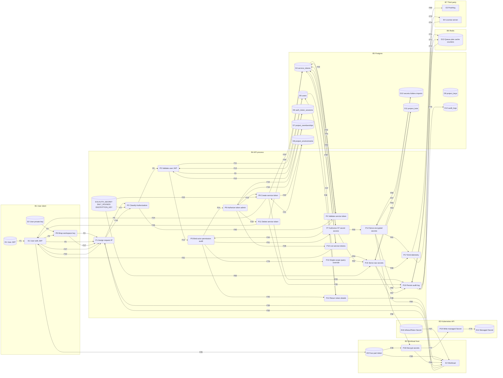

# Data flow diagram — service token

## 1. Scope

Feature: service token (`TableName.ServiceToken` / `AuthMode.SERVICE_TOKEN` / `ActorType.SERVICE`).

Version pin: `infisical/v0.47.0-postgres` (commit `041535bb47`).

In scope: create, list, and delete of `st.{id}.{secret}` tokens; client wrap of the workspace key into `encryptedKey`/`iv`/`tag`; GET of token details including that ciphertext; bcrypt authentication; CASL built from `scopes` and `permissions`; IP capture for audit; secret, folder, and import routes that accept `AuthMode.SERVICE_TOKEN`; encrypted and raw secret delivery; audit records for token CRUD and secret access; PostHog or Redis telemetry on secret operations; cascade delete with the project row; the Infisical CLI create and fetch paths; the Kubernetes operator service-token fetch path.

Out of scope: machine identities and universal auth. Kubernetes operator service-account authentication. `AuthTokenType.SERVICE_ACCESS_TOKEN` and `SERVICE_REFRESH_TOKEN` (enum members only; no route consumes them). Frontend `apiKeys` types named `CreateServiceTokenDataV3Res` (API-key mutations). Mongo models in `pg-migrator`. User login and org membership except as stores read during JWT validation and CASL. Secret-approval request generation (the service throws when `actor === ActorType.SERVICE`). There is no update route and no Infisical agent at this pin.

## 2. Diagram

## 3. External entities

| ID | Name | What it originates or receives |
|---|---|---|
| E1 | User with JWT | Originates create, list, and delete. Supplies the workspace key wrap. Receives `st.{id}.{secret}` and the sanitized token list. Browser: `ServiceTokenSection`. CLI: `infisical service-token create`. |
| E2 | Workload | Originates `Authorization: Bearer st.{id}.{secret}` (first three segments). Receives token details (`encryptedKey`, `iv`, `tag`, scopes, `workspace`) and secret ciphertext or plaintext. CLI `INFISICAL_TOKEN`, generic HTTP clients, Kubernetes operator reconcile. |
| E3 | PostHog | Receives `postHog.capture` for secret pull/create/update/delete when telemetry is enabled and the instance is cloud. |
| E4 | License server | On cloud, supplies `currentPlan` including `auditLogsRetentionDays` used before inserting audit rows. |

## 4. Processes

| ID | Name | Path | What it decides or transforms | Privilege |
|---|---|---|---|---|
| P1 | Assign request IP | `backend/src/server/plugins/ip.ts:20-29` | Sets `req.realIp` from the first present header in `headersOrder`, else `req.ip`. | Unauthenticated request. |
| P2 | Classify Authorization | `backend/src/server/plugins/auth/inject-identity.ts:47-89` | If `x-api-key` is set, API key. Else `Authorization` Bearer: prefix `st.` selects `AuthMode.SERVICE_TOKEN`; otherwise `jwt.verify` against `AUTH_SECRET` and `authTokenType`. | Unauthenticated until classification succeeds. |
| P3 | Validate user JWT | `backend/src/services/auth-token/auth-token-service.ts:133-144` | Loads `auth_token_sessions` by `tokenVersionId` and `userId`. Rejects missing session, stale `accessVersion`, missing or unaccepted user. Returns `user`, `tokenVersionId`, `organizationId`. | `ActorType.USER` after success. |
| P4 | Validate service token | `backend/src/services/service-token/service-token-service.ts:130-145` | `split(".", 3)` yields id and secret. Loads row. If `expiresAt` is in the past, `deleteById` then `UnauthorizedError`. `bcrypt.compare` of secret to `secretHash`. Writes `lastUsed`. | `ActorType.SERVICE` after success. |
| P5 | Bind actor, permission, audit | `inject-permission.ts:8-19`; `audit-log.ts:32-75`; `verify-auth.ts:6-16` | Maps actor to `req.permission`. Builds `req.auditLogInfo` (user email/username or service token name/id, IP, user-agent). `verifyAuth` requires `req.auth.authMode` in the route list. | Same actor as P3 or P4. |
| P6 | Authorize token administration | `permission-service.ts:148-162`, `204-214`; `project-permission.ts:105-108`, `175-178` | User CASL from `project_memberships` / `project_roles`. Create needs `Create` on `service-tokens` and `Create` on `Secrets` for each scope. Delete needs `Delete` on `service-tokens`. List needs `Read` on `service-tokens`. Admin and member built-in roles include those actions. Viewer includes `Read` only. | User project role. |
| P7 | Authorize service-token secret access | `permission-service.ts:178-190`; `project-permission.ts:233-268` | Reloads the token. Rejects when `serviceToken.projectId !== projectId`. Builds CASL: for each scope, `read` grants `Read` on `Secrets` with `{ secretPath: { $glob }, environment }`; `write` grants `Create`/`Edit`/`Delete` the same way. | `ActorType.SERVICE`. No org permission path (`getOrgPermission` has no `SERVICE` case). |
| P8 | Wrap workspace key | `AddServiceTokenModal.tsx:124-155`; `frontend/.../aes-256-gcm.ts:44-54`; `cli/packages/cmd/tokens.go:119-159` | Decrypts the user's project key (NaCl box). Generates 16 random bytes, hex-encodes them (32-character string). AES-256-GCM encrypts the workspace key with that string as the key. POST body carries `encryptedKey`, `iv`, `tag`. Client appends `.{hex}` to the returned token. | User private key on the client. |
| P9 | Create service token | `service-token-service.ts:37-91`; `service-token-router.ts:69-118` | Re-checks env slugs via `projectEnvDAL.findBySlugs`. `crypto.randomBytes(16).toString("hex")` then `bcrypt.hash(..., SALT_ROUNDS)`. Optional `expiresAt` from `expiresIn` seconds. Inserts row. Returns `st.{id}.{secret}` (three segments). Zod body does not include `randomBytes`. | User with P6 create privilege. |
| P10 | List service tokens | `service-token-service.ts:122-127`; `project-router.ts:344-366` | `GET /api/v1/workspace/:workspaceId/service-token-data`. `find({ projectId })` sorted by `createdAt` desc. Response schema omits `secretHash`, `encryptedKey`, `iv`, `tag`. | User with P6 read privilege. JWT only. |
| P11 | Delete service token | `service-token-service.ts:94-107`; `service-token-router.ts:121-157` | Loads by id. Authorizes against the row's `projectId`. `deleteById`. | User with P6 delete privilege. JWT only. |
| P12 | Return token details | `service-token-service.ts:110-119`; `service-token-router.ts:19-66` | `GET /api/v2/service-token`. Requires `ActorType.SERVICE`. Returns the token row including `encryptedKey`, `iv`, `tag`, plus `workspace` (`projectId`) and the creating user. `secretHash` is in `ServiceTokensSchema` for this response (not omitted). | The validated service token. |
| P13 | Single-scope query override | `secret-router.ts:61-71`, `146-156` | On raw GET list and GET-by-name, if actor is SERVICE, one scope, and `secretPath` is not a glob, overwrites `secretPath`, `environment`, and `workspaceId` from the token. Other ST secret routes use the request body/query as submitted, then P7. | `ActorType.SERVICE`. |
| P14 | Serve encrypted secrets | `secret-router.ts:427-486`; `secret-service.ts:406-441`; `secret-folder-router.ts:35`; `secret-import-router.ts:41` | CASL `Secrets` on `{ environment, secretPath }`. Returns ciphertext fields. For imports, `actor === ActorType.SERVICE` skips per-import CASL and allows all imports on the folder. Folder and import routers accept `SERVICE_TOKEN`. `getAProject` accepts `SERVICE_TOKEN` and only requires `getProjectPermission` to succeed. | Token CASL from P7. |
| P15 | Serve raw secrets | `secret-service.ts:725-755`; `project-bot-fns.ts:17-32` | Same authorization as P14, then decrypts with the project bot key: symmetric-decrypt bot private key, NaCl-open `encryptedProjectKey`. Personal secret type is forced to `shared` for SERVICE in `getSecretByName`. | Token CASL plus active project bot. |
| P16 | Persist audit log | `audit-log-service.ts:56-62`; `audit-log-queue.ts:24-61`; `audit-log.ts:51-57` | `pushToLog` onto BullMQ `audit-log`. Worker resolves `orgId` from the project if needed, `getPlan(orgId)`, skips insert when `auditLogsRetentionDays` yields TTL 0. Otherwise inserts actor, event, IP, user-agent. Token CRUD events: `create-service-token`, `delete-service-token`. Secret routes emit `GET_SECRETS` / `GET_SECRET` / create / update / delete. | In-process after P5. Actor metadata for SERVICE is `{ name, serviceId }`. |
| P17 | Emit telemetry | `telemetry-service.ts:62-89`; `telemetry.ts:13-14` | Cloud + `TELEMETRY_ENABLED`: PostHog capture with distinctId `createdByEmail` or `service-token-null-creator-{id}`. Self-host secret events increment Redis counters. | Same request actor. |
| P18 | Decrypt secrets | `cli/packages/util/secrets.go:20-80`; `k8-operator/packages/util/secrets.go:53-105` | Splits the four-part token. Sends three-part Bearer. AES-GCM decrypts `encryptedKey` with the fourth segment, then decrypts each secret key/value. Operator also expands `${...}` references with further ST fetches. | Possession of the four-part token. |
| P19 | Write managed Secret | `k8-operator/controllers/infisicalsecret_helper.go:180-195`, `241-264` | Writes plaintext map into the managed Kubernetes Secret. Stores ETag in annotation `secrets.infisical.com/version`. | Operator service account on the cluster. |

## 5. Data stores

| ID | Name | Backing store | Form at rest | Path |
|---|---|---|---|---|
| D1 | User JWT | Browser: in-memory `authTokenStorage`. CLI: OS keyring JSON `UserCredentials.JTWToken`. | Compact JWT. `jwt.verify` uses `AUTH_SECRET`. | `frontend/src/reactQuery.ts:19-43`; `cli/packages/util/credentials.go:22-33` |
| D2 | User private key | Browser `localStorage` key `PRIVATE_KEY`. CLI keyring `PrivateKey`. | NaCl secret key string (browser); base64 in CLI decrypt path. | `AddServiceTokenModal.tsx:133`; `saveTokenToLocalStorage.ts:60-61`; `tokens.go:119` |
| D3 | Four-part token | Clipboard after create; `INFISICAL_TOKEN` env; any file the operator of the workload chooses. | `st.{uuid}.{32-hex-secret}.{32-hex-aes-key}`. Only the first three segments are presented to the API. | `queries.tsx:41-43`; `tokens.go:159`; `secrets.go:251-328`; `constants.go:9` |
| D4 | Service tokens | Postgres `service_tokens` | `secretHash` bcrypt. `encryptedKey`/`iv`/`tag` AES-256-GCM ciphertext of the workspace key (nullable). `scopes` jsonb `{environment, secretPath}[]`. `permissions` `text[]` of `read`/`write`. `expiresAt`, `lastUsed`, `createdBy` (string, no FK in the migration), `projectId` FK `ON DELETE CASCADE`. | `db/schemas/service-tokens.ts:10-25`; `migrations/20231225072545_service-token.ts:8-24` |
| D5 | Users | Postgres `users` | Creating user joined on `createdBy`. Email used as telemetry distinctId. | `service-token-dal.ts:15-24`; `service-token-service.ts:116-118` |
| D6 | Auth token sessions | Postgres `auth_token_sessions` | `accessVersion` compared to JWT claim. | `auth-token-service.ts:134-139`; `models.ts:8` |
| D7 | Project memberships | Postgres `project_memberships` left join `project_roles` | Role slug or packed custom CASL rules. | `permission-dal.ts:44-58` |
| D8 | Project environments | Postgres `project_environments` | Slugs checked on create. | `service-token-service.ts:62-65` |
| D9 | Project keys | Postgres `project_keys` | NaCl box `encryptedKey` + `nonce` for a `receiverId`. | `db/schemas/project-keys.ts:10-18`; `v2/project-router.ts:21-64` |
| D10 | Secrets, folders, imports | Postgres `secrets`, `secret_folders`, `secret_imports` | Secret key/value/comment as AES-256-GCM ciphertext (`algorithm` default `aes-256-gcm`). Blind index stored separately. | `db/schemas/secrets.ts:10-33` |
| D11 | Project bots | Postgres `project_bots` | `encryptedPrivateKey` + `iv`/`tag` (Infisical symmetric); `encryptedProjectKey` + nonce (NaCl). `isActive` must be true for raw decrypt. | `db/schemas/project-bots.ts:10-25`; `project-bot-fns.ts:8-32` |
| D12 | Audit logs | Postgres `audit_logs` | Plaintext actor type/metadata, `eventType`, `eventMetadata`, `ipAddress`, `userAgent`, `userAgentType`, `expiresAt`. | `db/schemas/audit-logs.ts:10-24` |
| D13 | Redis | `REDIS_URL` via ioredis | BullMQ queue `audit-log` (job payload is the audit DTO). Key `infisical-cloud-plan-{orgId}`. Counters `telemetry-secret-processed`, `telemetry-secret-operations`. | `queue-service.ts:92-93`; `keystore.ts:5-17`; `license-service.ts:51`, `111-125`; `telemetry-service.ts:83-87` |
| D14 | Managed Kubernetes Secret | Cluster Secret named by `ManagedSecretReference` | Plaintext secret key/value bytes in `data`. | `infisicalsecret_helper.go:184-189` |
| D15 | Process secrets | Environment | `AUTH_SECRET` (JWT). `SALT_ROUNDS` default 10. `ENCRYPTION_KEY` / `ROOT_ENCRYPTION_KEY` for bot private-key unwrap. | `lib/config/env.ts:21-25`, `46` |
| D16 | Operator token Secret | Cluster Secret; key `infisicalToken` | Full four-part token (sample stores it base64 in `data`). Spaces stripped on read. | `infisicalsecret_helper.go:72-100`; `config/samples/serviceTokenSecret.yaml:1-7` |

## 6. Flows

### Provisioning

| ID | Source | Sink | Data carried | Sender identification | Transport | Payload encryption | Path |
|---|---|---|---|---|---|---|---|
| F1 | D1 | E1 | Access JWT string | Same process | Memory or keyring read | None | `reactQuery.ts:43`; `request.ts:20-31`; `credentials.go:36-50` |
| F2 | D2 | P8 | User private key | Same origin / keyring | localStorage or keyring | None | `AddServiceTokenModal.tsx:129-134`; `tokens.go:119` |
| F3 | E1 | P8 | Name, scopes, `expiresIn`, read/write flags | User UI / CLI flags | In-process | None | `AddServiceTokenModal.tsx:124-155`; `tokens.go:54-117` |
| F4 | P8 | P1 | `GET /api/v2/workspace/:id/encrypted-key` | `Authorization: Bearer` user JWT | HTTP | None beyond transport | `keys/queries.tsx:11-16`; `tokens.go:704-713`; `v2/project-router.ts:21-64` |
| F5 | E1 | P1 | `POST /api/v2/service-token/` body: `name`, `workspaceId`, `scopes`, `encryptedKey`, `iv`, `tag`, `expiresIn`, `permissions` | User JWT | HTTP | `encryptedKey` is AES-256-GCM of the workspace key | `service-token-router.ts:69-104`; `queries.tsx:39-43`; `tokens.go:143-153` |
| F6 | P1 | P2 | Request with `req.realIp` | Connection / forwarded headers | In-process | None | `ip.ts:22-29`; `inject-identity.ts:94-96` |
| F7 | D15 | P2 | `AUTH_SECRET` | Process env | In-process | Secret value | `inject-identity.ts:96`; `env.ts:46` |
| F8 | P2 | P3 | Decoded `AuthModeJwtTokenPayload` | Compact JWT | In-process | JWT already verified | `inject-identity.ts:64-72`, `100-102` |
| F9 | P3 | D6 | `tokenVersionId`, `userId` | JWT claims | Postgres | None | `auth-token-service.ts:134-137` |
| F10 | D6 | P3 | Session `accessVersion` | In-process | Postgres | None | `auth-token-service.ts:138-139` |
| F11 | P3 | D5 | `session.userId` | In-process | Postgres | None | `auth-token-service.ts:141-142` |
| F12 | D5 | P3 | User row `isAccepted` | In-process | Postgres | None | `auth-token-service.ts:142` |
| F13 | P3 | P5 | `req.auth` USER | In-process | In-process | None | `inject-identity.ts:100-102`; `verify-auth.ts:12-15`; `service-token-router.ts:72` |
| F14 | P5 | P6 | `actor`, `actorId`, `actorOrgId` | User JWT | In-process | None | `inject-permission.ts:11-12`; `service-token-service.ts:50` |
| F15 | P6 | D7 | `(userId, projectId)` | User id | Postgres | None | `permission-dal.ts:44-58` |
| F16 | D7 | P6 | Role and optional packed rules | In-process | Postgres | None | `permission-service.ts:148-162` |
| F17 | P8 | P1 | Same as F4 when CLI/browser fetches the project key before wrap | User JWT | HTTP | None beyond transport | `AddServiceTokenModal.tsx:106`, `129-134` |
| F18 | P1 | P2 | Encrypted-key GET after IP assign | User JWT | In-process | None | `v2/project-router.ts:44` (`onResponse: verifyAuth([JWT, API_KEY])`) |
| F19 | P6 | P9 | Permission object after `Create` on `service-tokens` and `Secrets` per scope | User | In-process | None | `service-token-service.ts:50-57` |
| F20 | P9 | D8 | Distinct environment slugs | In-process | Postgres | None | `service-token-service.ts:63-65` |
| F21 | D8 | P9 | Matching env rows | In-process | Postgres | None | `service-token-service.ts:64-65` |
| F22 | D15 | P9 | `SALT_ROUNDS` | Process env | In-process | None | `service-token-service.ts:60`, `68`; `env.ts:21` |
| F23 | P9 | D4 | `name`, `createdBy`, `encryptedKey`, `iv`, `tag`, `expiresAt`, `secretHash`, `permissions`, `scopes` JSON, `projectId` | In-process | Postgres | Hash and ciphertext as stored | `service-token-service.ts:76-87` |
| F24 | P9 | E1 | `{ serviceToken: "st.{id}.{secret}", serviceTokenData }` without hash/key in `serviceTokenData` | Server | HTTP | None beyond transport | `service-token-router.ts:11-16`, `117` |
| F25 | E1 | D3 | `serviceToken + "." + randomBytes` | Local append | Memory / clipboard / stdout | None | `queries.tsx:42`; `tokens.go:159` |
| F26 | P9 | P16 | `CREATE_SERVICE_TOKEN` metadata `name`, `scopes` | `req.auditLogInfo` (user) | In-process | None | `service-token-router.ts:106-116` |

### Runtime

| ID | Source | Sink | Data carried | Sender identification | Transport | Payload encryption | Path |
|---|---|---|---|---|---|---|---|
| F27 | E1 | P1 | `GET /api/v1/workspace/:workspaceId/service-token-data` | User JWT | HTTP | None beyond transport | `project-router.ts:344-365`; `serviceTokens/queries.tsx:16-21` |
| F28 | P6 | P10 | `Read` on `service-tokens` | User | In-process | None | `service-token-service.ts:123-124` |
| F29 | P10 | D4 | `{ projectId }` | In-process | Postgres | None | `service-token-service.ts:126` |
| F30 | D4 | P10 | Token rows | In-process | Postgres | Hash and key columns present in DAL result; response schema omits them | `service-token-router.ts:11-16`, `351-353` |
| F31 | P10 | E1 | `{ serviceTokenData }` sanitized | Server | HTTP | None beyond transport | `project-router.ts:365` |
| F32 | E1 | P1 | `DELETE /api/v2/service-token/:serviceTokenId` | User JWT | HTTP | None beyond transport | `service-token-router.ts:121-140`; `queries.tsx:51-61` |
| F33 | P6 | P11 | `Delete` on `service-tokens` | User | In-process | None | `service-token-service.ts:98-104` |
| F34 | P11 | D4 | `deleteById` | In-process | Postgres | Row removed | `service-token-service.ts:106` |
| F35 | P11 | P16 | `DELETE_SERVICE_TOKEN` metadata `name`, `scopes` | `req.auditLogInfo` (user) | In-process | None | `service-token-router.ts:143-153` |
| F36 | P11 | E1 | `{ serviceTokenData }` sanitized | Server | HTTP | None beyond transport | `service-token-router.ts:155` |
| F37 | D16 | E2 | `infisicalToken` bytes | Operator kube client | Kubernetes API | None | `infisicalsecret_helper.go:85-100` |
| F38 | D3 | E2 | Four-part token string | Env / file | Process env | None | `secrets.go:251-328` |
| F39 | E2 | P1 | `GET /api/v2/service-token` | `Authorization: Bearer st.{id}.{secret}` | HTTP | None beyond transport | `inject-identity.ts:56-61`; `k8-operator/packages/api/api.go:31-37`; `cli/packages/api/api.go` GET v2/service-token |
| F40 | P2 | P4 | Full Bearer value starting `st.` | Prefix classification | In-process | None | `inject-identity.ts:56-61`, `115-123` |
| F41 | P4 | D4 | Token id (second segment) | Bearer | Postgres | None | `service-token-service.ts:131-132`; `service-token-dal.ts:15-24` |
| F42 | D4 | P4 | Row including `secretHash`, `expiresAt` | In-process | Postgres | Hash compared in process | `service-token-service.ts:133-140` |
| F43 | P4 | D4 | `lastUsed` now, or `deleteById` on expiry | In-process | Postgres | None | `service-token-service.ts:135-144` |
| F44 | P4 | P5 | `req.auth` SERVICE + token row | In-process | In-process | None | `inject-identity.ts:115-123`; `verify-auth.ts:12`; `service-token-router.ts:22` |
| F45 | P5 | P12 | `actor === SERVICE` | Token | In-process | None | `service-token-service.ts:111` |
| F46 | P12 | D5 | `createdBy` | In-process | Postgres | None | `service-token-service.ts:116` |
| F47 | D5 | P12 | Creating user | In-process | Postgres | None | `service-token-service.ts:116-118` |
| F48 | P12 | E2 | Token fields including `encryptedKey`, `iv`, `tag`, `workspace`, `user` | Server | HTTP | Ciphertext fields remain ciphertext | `service-token-router.ts:31-65` |
| F49 | D3 | P18 | Fourth segment (hex AES key) | Local split | In-process | None | `secrets.go:21-26`, `58-66`; `k8-operator/.../secrets.go:54-89` |
| F50 | E2 | P1 | `GET /api/v3/secrets` query `workspaceId`, `environment`, `secretPath`, `include_imports`; or `/raw`; or folder/import routes | Three-part Bearer | HTTP | None beyond transport | `secret-router.ts:476`; `api.go:54-70`; `folders.go:85-96` |
| F51 | P5 | P7 | `getProjectPermission(SERVICE, tokenId, projectId)` | Token | In-process | None | `secret-service.ts:406`; `permission-service.ts:213-214` |
| F52 | P7 | D4 | Token id | In-process | Postgres | None | `permission-service.ts:179` |
| F53 | D4 | P7 | `projectId`, `scopes`, `permissions` | In-process | Postgres | None | `permission-service.ts:182-188` |
| F54 | P13 | P15 | Possibly overwritten `workspaceId` / `environment` / `secretPath` on raw GET list and GET-by-name | Single non-glob scope | In-process | None | `secret-router.ts:63-70`, `148-156` |
| F78 | P5 | P13 | Raw GET `/api/v3/secrets/raw` after SERVICE auth | Token | In-process | None | `secret-router.ts:59-71` |
| F55 | P7 | P14 | CASL allow on `Secrets` | Token | In-process | None | `secret-service.ts:407-410` |
| F56 | P14 | D10 | Folder path + folder id | In-process | Postgres | None | `secret-service.ts:412-416` |
| F57 | D10 | P14 | Ciphertext secret rows; import rows | In-process | Postgres | Ciphertext at rest | `secret-service.ts:416-438` |
| F58 | P14 | P18 | Encrypted secret list (and imports) | Server | HTTP | Ciphertext in JSON | `secret-router.ts:478-486`; `secrets.go:47-68` |
| F59 | P18 | E2 | Plaintext keys and values | Local decrypt | In-process | None after decrypt | `secrets.go:68-80`; `k8-operator/.../secrets.go:92-105` |
| F60 | P14 | P16 | `GET_SECRETS` (or create/update/delete event) metadata | `req.auditLogInfo` (SERVICE) | In-process | None | `secret-router.ts:85-96` |
| F61 | P14 | P17 | `SecretPulled` (or created/updated/deleted) properties including `auditLogInfo` | Same | In-process | None | `secret-router.ts:98-109` |
| F62 | P7 | P15 | Same CASL as P14 | Token | In-process | None | `secret-service.ts:737-745` |
| F63 | P15 | D11 | `{ projectId }` | In-process | Postgres | None | `project-bot-fns.ts:18` |
| F64 | D11 | P15 | Bot keys | In-process | Postgres | Encrypted private key and project key | `project-bot-fns.ts:20-32` |
| F65 | D15 | P15 | `ENCRYPTION_KEY` / `ROOT_ENCRYPTION_KEY` via `infisicalSymmetricDecrypt` | Process env | In-process | Secret value | `project-bot-fns.ts:8-14`; `encryption.ts:216` |
| F66 | P15 | E2 | `{ secrets: [{ secretKey, secretValue, ... }] }` | Server | HTTP | Plaintext values in JSON | `secret-service.ts:747-755`; `secret-router.ts:59` |
| F67 | P15 | P16 | Same audit events as encrypted routes | SERVICE actor | In-process | None | `secret-router.ts:85-96` |
| F68 | P15 | P17 | Same PostHog/counter events | SERVICE actor | In-process | None | `secret-router.ts:98-109` |

### Lifecycle end

| ID | Source | Sink | Data carried | Sender identification | Transport | Payload encryption | Path |
|---|---|---|---|---|---|---|---|
| F69 | P17 | E3 | Event name, `distinctId`, properties | PostHog project API key | HTTPS to `POSTHOG_HOST` | None beyond that client | `telemetry-service.ts:33-35`, `67-71` |
| F70 | P17 | D13 | Increment secret processed/operations keys | In-process | Redis | None | `telemetry-service.ts:83-87` |
| F71 | P16 | D13 | Audit DTO job on queue `audit-log` | In-process | Redis / BullMQ | Plaintext job payload | `audit-log-queue.ts:24-30`; `queue-service.ts:14`, `92-93` |
| F72 | D13 | P16 | Job payload | Worker | Redis | None | `audit-log-queue.ts:33-34` |
| F73 | P16 | E4 | `GET /api/license-server/v1/customers/:customerId/cloud-plan` when cache miss on cloud | License-server client | HTTP | None beyond that client | `license-service.ts:110-120` |
| F74 | E4 | P16 | `currentPlan` including `auditLogsRetentionDays` | License server | HTTP | None beyond that client | `license-service.ts:117-126` |
| F75 | P16 | D12 | Actor, event, IP, user-agent, `expiresAt` | Worker | Postgres | None | `audit-log-queue.ts:50-61` |
| F76 | P19 | D14 | Plaintext secret map + ETag annotation | Operator | Kubernetes API | None | `infisicalsecret_helper.go:184-189` |
| F77 | P18 | P19 | Plaintext secrets after decrypt | Operator process | In-process | None | `infisicalsecret_helper.go:245-264` |

Project delete removes `service_tokens` rows by foreign key `ON DELETE CASCADE` (`migrations/20231225072545_service-token.ts:23`). Expired tokens are removed in F43 on the next authentication attempt.

### Observability

Covered by F26, F35, F60, F61, F67–F75. Secret routes also record `userAgentType` from `User-Agent` (`cli`, `k8-operator`, browser Mozilla, SDKs) in `audit-log.ts:7-29`. Rate limiters key on `req.realIp` (`rateLimiter.ts:17-30`).

## 7. Trust boundaries

| ID | Where it sits | What changes across it | Flows |
|---|---|---|---|
| B1 | User client | The user JWT, `PRIVATE_KEY`, and the displayed four-part token are under the user. HTTP leaves this subgraph toward P1. | F1–F5, F17, F24, F25, F27, F31, F32, F36 |
| B2 | Workload host | The four-part token and decrypted secrets are under the host. HTTP leaves this subgraph toward P1. | F38, F39, F48–F50, F58, F59, F66 |
| B3 | Kubernetes API | Cluster RBAC replaces the operator process for Secret objects. Token material and plaintext secrets rest in etcd-backed Secrets. | F37, F76, F77 |
| B4 | API process | After P2–P5, identity is a user JWT or a bcrypt-validated service token. `AUTH_SECRET` and `SALT_ROUNDS` live here. | F6–F16, F18–F23, F26, F28–F30, F33–F35, F40–F47, F51–F57, F60–F68, F78 |
| B5 | Postgres | Application credentials become database privilege. Rows persist after the request. | F9–F12, F15, F16, F20, F21, F23, F29, F30, F34, F41–F43, F46, F47, F52, F53, F56, F57, F63, F64, F75 |
| B6 | Redis | Queue payloads, plan JSON, and counters persist independently of the HTTP request. | F70–F72 |
| B7 | Third party | Telemetry and cloud plan data leave the deployment. | F69, F73, F74 |

## 8. Open questions

- Whether TLS terminates in front of the Fastify process is not decided in this repository. Flows list transport as HTTP as the server receives it (`HTTPS_ENABLED` is read in `env.ts:26`).
- `GET /api/v2/workspace/:workspaceId/encrypted-key` registers `verifyAuth` as `onResponse` rather than `onRequest` (`v2/project-router.ts:44`). Whether the handler runs before AuthMode is enforced is not resolved from the Fastify hook order in this repo.
- `createdBy` is a non-FK string (`migrations/20231225072545_service-token.ts:21`). What happens to token rows when the creating user is deleted is not in the service-token service.
- Callers that send the four-part string as `Authorization` without stripping the fourth segment are not in `cli/` or `k8-operator/`. `split(".", 3)` would put `secret.fourth` into `TOKEN_SECRET` (`service-token-service.ts:131`).
- `AuthTokenType.SERVICE_ACCESS_TOKEN` / `SERVICE_REFRESH_TOKEN` have no `inject-identity` branch. Whether any out-of-repo client still presents those JWTs at this pin is not visible here.
