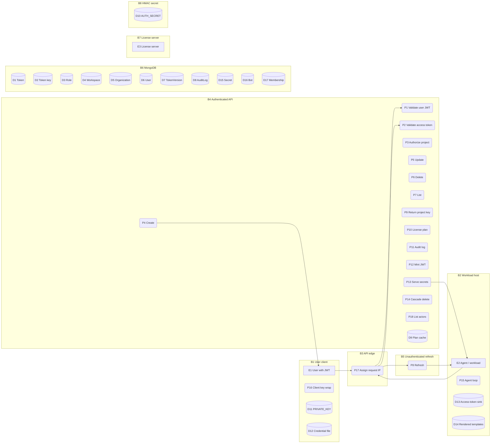

# Threat model — service token

## 1. Scope

Feature: service token (`ServiceTokenDataV3` / `AuthMode.SERVICE_ACCESS_TOKEN`).

Version pin: `infisical/v0.42.0` (commit `735cf093f0`).

Inputs: `serviceTokenDfd.md`, `securityAssumptions.md`.

Excluded: service token v1 and v2, Kubernetes operator, user login, and the secrets engine except where `SERVICE_ACCESS_TOKEN` is an accepted auth mode.

## 2. Data flow

Element IDs are those of `serviceTokenDfd.md`. The chart below keeps every boundary and every process and store. Flow edges are omitted here; F1–F81 stay in the DFD.

| ID | Kind | Name |
|---|---|---|
| E1 | External | User with JWT |
| E2 | External | Agent / workload |
| E3 | External | License server |
| P1 | Process | Validate user JWT |
| P2 | Process | Validate access token |
| P3 | Process | Authorize project action |
| P4 | Process | Create token |
| P5 | Process | Update token |
| P6 | Process | Delete token |
| P7 | Process | List tokens |
| P8 | Process | Refresh tokens |
| P9 | Process | Return project key |
| P10 | Process | Resolve license plan |
| P11 | Process | Write audit log |
| P12 | Process | Mint JWT |
| P13 | Process | Serve secrets |
| P14 | Process | Cascade delete |
| P15 | Process | Agent refresh loop |
| P16 | Process | Client key wrap |
| P17 | Process | Assign request IP |
| P18 | Process | List audit-log actors |
| D1–D8, D15–D17 | Store | MongoDB collections as in the DFD |
| D9 | Store | License plan cache |
| D10 | Store | HMAC signing secret |
| D11 | Store | Browser `PRIVATE_KEY` |
| D12 | Store | Credential file |
| D13 | Store | Sink access token |
| D14 | Store | Rendered templates |

| ID | What changes across it |
|---|---|
| B1 | User JWT, `PRIVATE_KEY`, and the downloaded refresh bundle are under the client. |
| B2 | Refresh token file, sink files, and rendered secrets are under the host. |
| B3 | `req.realIP` is assigned from `cf-connecting-ip` or `req.ip` before route auth. |
| B4 | Handlers behind `requireAuth`. Identity is a user JWT or a service access JWT. |
| B5 | `POST /me/token` identifies the caller only by the refresh JWT in the body. |
| B6 | Application credentials become database privilege. |
| B7 | On cloud, plan flags come from E3. Otherwise P10 returns `globalFeatureSet`. |
| B8 | Ability to mint or accept service JWTs is possession of D10. |

## 3. Assumptions

| ID | Statement | Class |
|---|---|---|
| A1 | A token has no intrinsic environment binding. Built-in roles cover every environment in the project. | Threat-enabling |
| A2 | Access tokens are bounded by `accessTokenTTL`. The refresh credential is bounded only if `expiresIn` is set. The refresh JWT itself is signed with no `expiresIn`. | Upheld for the access JWT. Threat-enabling for the refresh JWT. Environmental for `expiresAt`. |
| A3 | Only the refresh token needs durable storage. The access token is ephemeral. | Environmental. The first-party agent writes the access token to disk (`P15` → `D13`). |
| A4 | Token administration and project-key delivery are bound to the token's project. Secret authorization uses the `workspaceId` in the request. | Threat-enabling |
| A5 | A service token cannot obtain org-level API control. The ceiling is project admin. | Upheld by code |
| A6 | Origin is `0.0.0.0/0` by default. An allowlist is enforceable. The source address is whatever P17 records. | Threat-enabling by default. Conditional when an allowlist and a trusted proxy are both present. |
| A7 | Authentication is `jwt.verify` plus `isActive`, `expiresAt`, and `tokenVersion`, then a database write. | Upheld by code |
| A8 | Immediate, generational, and time-based revocation exist. None is applied by policy. | Environmental |
| A9 | Audit actor is the token (`serviceId`, `name`) plus IP and user agent. Retention follows the license. | Threat-enabling for shared tokens. Environmental for durability. |
| A10 | Authentication is HMAC plus indexed reads. There is no adaptive hash on the request path. | Upheld by code |

## 4. Threats

### T1 — Cross-project secret access

- **Target:** P3, P13, F54, F59
- **STRIDE:** Elevation of privilege
- **Exploits:** A4
- **Narrative:** An attacker holds a valid access JWT. They call `GET /api/v3/secrets/raw` with a `workspaceId` that is not the project the token was issued for. P2 accepts the bearer value. P3 builds an ability from the token's role and evaluates it against the requested project. P13 loads D15 and D16 for that `workspaceId` and returns plaintext.
- **Impact:** Read or write secrets in any project whose bot is active, including other organizations on a shared instance.
- **Mitigations:** none
- **Strength:** —

### T2 — Built-in role covers every environment

- **Target:** P3, P13
- **STRIDE:** Elevation of privilege
- **Exploits:** A1
- **Narrative:** An operator issues a token with `viewer`, `member`, or `admin`. The caller requests any `environment` and `secretPath`. The built-in ability grants `Secrets` with no environment condition.
- **Impact:** One leaked token exposes every environment that role can read or write.
- **Mitigations:** M6
- **Strength:** M6 conditional — only if the token is assigned a custom role whose rules name `environment` / `secretPath`

### T3 — Stolen refresh JWT at the unauthenticated grant

- **Target:** P8, D12, F46, B5
- **STRIDE:** Spoofing
- **Exploits:** A2, A3, A8
- **Narrative:** An attacker reads D12. They `POST /api/v3/service-token/me/token` with that string. P8 is not behind `requireAuth`. The refresh JWT carries no `exp` when P12 minted it without `expiresIn`. The grant continues until someone revokes the row or its version.
- **Impact:** Long-lived minting of access JWTs, then T1 and T2.
- **Mitigations:** M1, M2, M8, M10
- **Strength:** M1 partial; M2 partial; M8 conditional — operator must revoke; M10 conditional — rotation enabled and the consumer persists the new refresh JWT

### T4 — World-readable access-token sink

- **Target:** P15, D13, F53
- **STRIDE:** Information disclosure
- **Exploits:** A3
- **Narrative:** The agent writes the access JWT to a sink file. Another local account reads D13 and presents the JWT to P2.
- **Impact:** Secret access for the remaining `accessTokenTTL`, without the refresh credential.
- **Mitigations:** M3
- **Strength:** M3 partial — bounds how long the stolen access JWT works; does not stop the read of D13

### T5 — Source-IP spoof through P17

- **Target:** P17, P3, F5, B3
- **STRIDE:** Spoofing
- **Exploits:** A6
- **Narrative:** P17 takes the client address from `cf-connecting-ip` or `req.ip`. P3 compares that address to `trustedIps`. The attacker sets the header to an address inside the allowlist.
- **Impact:** A CIDR restriction does not apply unless a proxy overwrites those headers.
- **Mitigations:** none
- **Strength:** —

### T6 — Possession equals access on the default origin

- **Target:** D1, P4, P10
- **STRIDE:** Spoofing
- **Exploits:** A6
- **Narrative:** A token is created with the default `0.0.0.0/0`. The plan used by P10 does not allow a narrower CIDR. A stolen access or refresh JWT works from any address.
- **Impact:** Network origin is not a control.
- **Mitigations:** M7
- **Strength:** M7 conditional — `ipAllowlisting` is on, `trustedIps` is not `0.0.0.0/0`, and T5 is closed

### T7 — Shared-token actions are one actor

- **Target:** P2, P11, D8
- **STRIDE:** Repudiation
- **Exploits:** A9
- **Narrative:** Two workloads share one token. P2 labels both as the same `serviceId` and `name`. P11 is not invoked on refresh or secret use. If an admin event is later written, it still names one token.
- **Impact:** An investigator cannot tell which workload read secrets.
- **Mitigations:** none
- **Strength:** —

### T8 — Audit rows expire at write time

- **Target:** P11, D8, P10
- **STRIDE:** Repudiation
- **Exploits:** A9
- **Narrative:** P11 writes create, update, and delete events with `expiresAt` derived from the plan's retention days. Retention is zero. D8's TTL index removes the row.
- **Impact:** No durable trail of issuance or revocation.
- **Mitigations:** M9
- **Strength:** M9 conditional — `auditLogsRetentionDays > 0`

### T9 — Unauthenticated refresh as a cheap flood

- **Target:** P8, B5
- **STRIDE:** Denial of service
- **Exploits:** A10, B5
- **Narrative:** Anyone can POST to `/me/token`. Each call verifies a JWT and, on success, writes D1. The application limiter, when mounted, keys on `realIP` before P17 assigns it.
- **Impact:** A shared instance-wide bucket, or no application limit. The grant and D1 take the load.
- **Mitigations:** none
- **Strength:** —

### T10 — Token inventory without a project permission check

- **Target:** P7, F40
- **STRIDE:** Information disclosure
- **Exploits:** none of A1–A10
- **Narrative:** A caller with any valid user JWT requests `GET /api/v3/workspaces/:workspaceId/service-token`. P7 lists D1 for that id. P3 is not on this path.
- **Impact:** Cross-project inventory of token names, roles, IPs, and usage fields.
- **Mitigations:** none
- **Strength:** —

### T11 — Project-admin token plus T1

- **Target:** P3
- **STRIDE:** Elevation of privilege
- **Exploits:** A4, A5
- **Narrative:** A token is created with `role: admin`. P3 maps that to the admin ability. The caller names a different `workspaceId` on a route that accepts `SERVICE_ACCESS_TOKEN`. The ability is evaluated on the requested project.
- **Impact:** Admin-level secret actions on a project the token was not issued for. Same P3 function applies wherever `SERVICE_ACCESS_TOKEN` is accepted.
- **Mitigations:** none
- **Strength:** —

### T12 — Credential JSON is a workspace-key package

- **Target:** P16, D12, F3
- **STRIDE:** Information disclosure
- **Exploits:** A3
- **Narrative:** P16 writes `{ public_key, private_key, refresh_token }` to D12. D2 holds `encryptedKey` wrapped to that public key. Anyone with the file has the refresh JWT and the NaCl secret that opens the workspace key.
- **Impact:** Token use plus client-side decryption of project secrets if the ciphertext is also obtained.
- **Mitigations:** none
- **Strength:** —

### T13 — User issues or revokes a token without project standing

- **Target:** P4, P5, P6, F4, F26, F33
- **STRIDE:** Elevation of privilege
- **Exploits:** none of A1–A10 as a gap; A5 is the property this would violate
- **Narrative:** A caller presents a user JWT and `POST`s, `PATCH`es, or `DELETE`s a service token for a workspace they do not belong to, or for which they lack `service-tokens` create, edit, or delete.
- **Impact:** Unauthorized machine credentials, or denial of a legitimate token.
- **Mitigations:** M4, M5
- **Strength:** M4 full; M5 full

## 5. Mitigations

### M1 — HMAC verify and token-type split

- **Targets:** T3 partial
- **Upholds:** A7
- **Evidence:** `backend/src/utils/authn/authModeValidators/serviceTokenV3.ts:15-19`; `backend/src/ee/controllers/v3/serviceTokenDataController.ts:71-75`; `backend/src/utils/authn/helpers/index.ts:71-81`
- **Notes:** The caller must present a JWT signed with D10 whose `authTokenType` is `serviceRefreshToken` or `serviceAccessToken`. A stolen JWT that already has that shape still authenticates.

### M2 — Server-side `isActive`, `expiresAt`, `tokenVersion`

- **Targets:** T3 partial
- **Upholds:** A7, A8
- **Evidence:** `backend/src/utils/authn/authModeValidators/serviceTokenV3.ts:21-50`; `backend/src/ee/controllers/v3/serviceTokenDataController.ts:77-87`
- **Notes:** Use stops after an operator flips `isActive`, deletes the row, waits out `expiresAt`, or bumps `tokenVersion`. Nothing happens until then.

### M3 — Access JWT `expiresIn: accessTokenTTL`

- **Targets:** T4 partial
- **Upholds:** A2
- **Evidence:** `backend/src/ee/controllers/v3/serviceTokenDataController.ts:126-134`; `backend/src/validation/serviceTokenDataV3.ts:24`; `backend/src/helpers/auth.ts:106-121`
- **Notes:** Enforced by default on every mint. Bounds a stolen access JWT. Does not bound the refresh JWT. Does not change D13's file mode.

### M4 — CASL `service-tokens` on create, update, delete

- **Targets:** T13 full
- **Upholds:** A5
- **Evidence:** `backend/src/ee/controllers/v3/serviceTokenDataController.ts:173-181`, `310-318`, `429-437`
- **Notes:** Enforced by default on P4, P5, and P6. Not on P7.

### M5 — User membership at P3

- **Targets:** T13 full
- **Upholds:** A5
- **Evidence:** `backend/src/ee/services/ProjectRoleService.ts:263-279`
- **Notes:** Enforced by default for `ActorType.USER` on paths that call P3. P4, P5, and P6 call P3. P7 does not.

### M6 — Custom-role environment conditions

- **Targets:** T2 conditional — token uses a custom role whose rules include `environment` / `secretPath`
- **Upholds:** A1
- **Evidence:** `backend/src/ee/services/ProjectRoleService.ts:60-68`, `319-326`; `backend/src/controllers/v3/secretsController.ts:103-116`
- **Notes:** Available to the operator. Built-in roles have no environment condition. `globalFeatureSet.rbac` is `false` (`EELicenseService.ts:69`) and is not read by this path.

### M7 — `trustedIps` checked at P3

- **Targets:** T6 conditional — `ipAllowlisting` is on, `trustedIps` is not `0.0.0.0/0`, and P17's address is not caller-controlled
- **Upholds:** A6
- **Evidence:** `backend/src/ee/services/ProjectRoleService.ts:299-302`; `backend/src/utils/ip/ip.ts:109-136`; license gate `serviceTokenDataController.ts:203-206`; default CIDR `serviceTokenDataV3.ts:124-128`
- **Notes:** Exists, off by default. Self-hosted `ipAllowlisting` is `false` (`EELicenseService.ts:68`). EE / license-gated.

### M8 — Operator revocation paths

- **Targets:** T3 conditional — operator sets `isActive: false`, deletes the row, or set `expiresIn` so `expiresAt` elapses
- **Upholds:** A8
- **Evidence:** `backend/src/ee/controllers/v3/serviceTokenDataController.ts:363-368`, `439-447`; `backend/src/utils/authn/authModeValidators/serviceTokenV3.ts:30-40`
- **Notes:** Available to the operator. Not applied by policy.

### M9 — Audit document on token CRUD

- **Targets:** T8 conditional — `auditLogsRetentionDays > 0`
- **Upholds:** A9
- **Evidence:** `backend/src/ee/controllers/v3/serviceTokenDataController.ts:262-277`, `391-406`, `449-464`; `backend/src/ee/services/EEAuditLogService.ts:19-45`; default retention `EELicenseService.ts:73`; TTL `backend/src/ee/models/auditLog/auditLog.ts:60-63`
- **Notes:** Writes are default. Durability is licensed. P2 and P8 never call P11. Does not address T7.

### M10 — Refresh-token rotation

- **Targets:** T3 conditional — `isRefreshTokenRotationEnabled` is true and the consumer persists the new refresh JWT
- **Upholds:** A8
- **Evidence:** `backend/src/ee/controllers/v3/serviceTokenDataController.ts:101-124`; default `false` at `backend/src/validation/serviceTokenDataV3.ts:27`
- **Notes:** Off by default. P15 assigns the new refresh token in memory only (`cli/packages/cmd/agent.go:227`).

No mitigation was found for T1, T5, T7, T9, T10, T11, or T12.

## 6. Traceability

Each row is one `(T#, M#, A#, strength)` tuple. Every association in §4 and §5 appears once per assumption the mitigation upholds for that threat. Nothing else appears.

| T# | M# | A# | Strength |
|---|---|---|---|
| T2 | M6 | A1 | conditional |
| T3 | M1 | A7 | partial |
| T3 | M2 | A7 | partial |
| T3 | M2 | A8 | partial |
| T3 | M8 | A8 | conditional |
| T3 | M10 | A8 | conditional |
| T4 | M3 | A2 | partial |
| T6 | M7 | A6 | conditional |
| T8 | M9 | A9 | conditional |
| T13 | M4 | A5 | full |
| T13 | M5 | A5 | full |

T1, T5, T7, T9, T10, T11, T12 have no row.

## 7. Residual risk

| Threat | Coverage | What closes it |
|---|---|---|
| T1 | none | A workspace-equality check on the `SERVICE_V3` branch of P3, matching the v2 branch at `ProjectRoleService.ts:283`. Configuration cannot substitute. |
| T2 | M6 conditional | Assign a custom role conditioned on `environment` and `secretPath`. Do not use built-in roles for machine tokens. |
| T3 | M1/M2 partial; M8/M10 conditional | Set `expiresIn`. Enable rotation only if the consumer writes back the new refresh JWT. Restrict D12. Revoke on theft. |
| T4 | M3 partial | Do not use world-readable file sinks. M3 only limits remaining access-token lifetime. |
| T5 | none | A proxy that overwrites `cf-connecting-ip` and `X-Forwarded-For`. The application will not. |
| T6 | M7 conditional | License `ipAllowlisting` and set `trustedIps` to egress. Still requires T5 closed. |
| T7 | none | One token per workload. P11 does not record secret reads or refreshes. |
| T8 | M9 conditional | A plan with `auditLogsRetentionDays > 0`. Runtime use is still unaudited. |
| T9 | none | Rate-limit `/api/v3/service-token/me/token` on the proxy, keyed on an address the proxy assigns. |
| T10 | none | Call P3 from P7. No operator setting adds that check. |
| T11 | none | Do not issue `admin` tokens. Close T1 or the admin ability is evaluated on the requested project. |
| T12 | none | Treat D12 as a secret. No server-side control after F3. |
| T13 | M4 full, M5 full | Closed on P4, P5, P6. |

## 8. Input defects

- A3 states the access token is ephemeral. P15 writes it to D13 at `0644`. The assumption describes an intended posture the first-party agent does not implement.
- A2 says the presented credential is always time-boxed. That is true of the access JWT. The refresh JWT is minted with no `expiresIn`. The assumption set does not say that.
- A9 does not state that P2 and P8 never write D8. Attribution of runtime use is not merely coarse; it is absent.
- The assumption set has no row for list/inventory authorization. T10 has nothing to bind to.
- The assumption set has no row for D10 compromise. Minting a well-formed access JWT for a known `serviceTokenDataId` and `tokenVersion` is in scope for B8 and is not modeled.
- `serviceTokenDfd.md` lists P7 as JWT-only and does not mark the missing P3 call as a missing flow. The handler is complete as drawn; the authorization step is simply not there.
- A5 is upheld for org routes. It does not constrain T11 inside a project, or T1 across projects.
